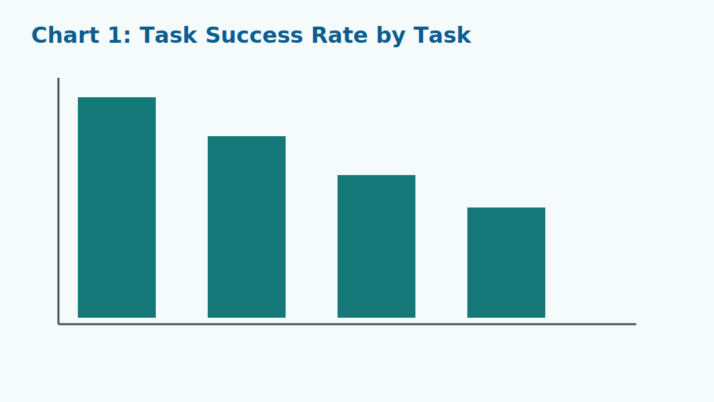
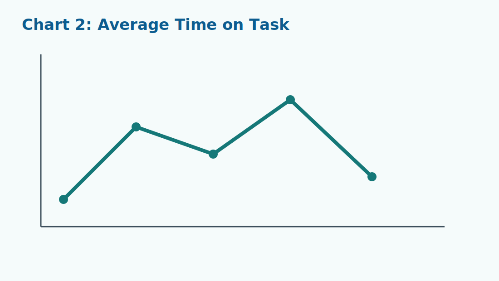
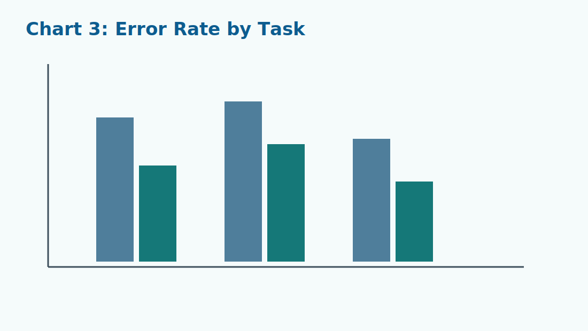
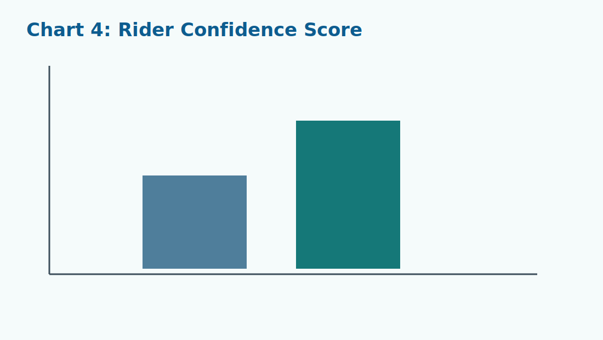

## Methodology

Our team ran a structured usability study on the existing MARTA app to evaluate how effectively riders can complete common transit tasks. The study included **5 participants** representing a mix of daily commuters and occasional transit users. Sessions were conducted using moderated think-aloud testing, and each participant used a mobile device in realistic scenarios that required route planning, service monitoring, and fare-related actions.

Participants were assigned four core tasks: (1) plan a trip with one transfer, (2) find the next arrival and confirm delay status, (3) purchase a fare product, and (4) respond to a disruption by selecting an alternate route. Before testing, each participant answered short pre-test questions about transit familiarity and confidence with mobile navigation. After testing, participants completed a post-test reflection on confidence, perceived effort, and trust in app feedback.

During sessions, we captured both quantitative and qualitative data. Quantitative measures included task success rate, time on task, number of errors, and number of backtracks per task. Qualitative measures included verbal comments, moments of hesitation, and interaction patterns captured through screen recordings. Issues were tagged by severity based on user impact and frequency across participants.

All findings below are templates grounded in evidence-based reporting format. Replace placeholder values with your final study numbers, screenshots, and quotes. Focus the page on **product performance** and avoid demographic charts, per project requirements.

## Findings and Analysis

### Findings

**Issue 1: Route planning steps were not obvious enough for fast completion.**
In Task 1, users frequently paused between entering origin/destination and confirming the trip option. Multiple participants opened and closed the same panel before selecting a route because action hierarchy was unclear. Insert your measured success-rate and median completion-time values here.

**Issue 2: Real-time status was available but not immediately trustworthy.**
Participants reported uncertainty when comparing scheduled vs. live status, especially during transfer-heavy routes. Some users interpreted stale timestamps as current updates. Insert your observed confusion frequency and confidence drop metrics.

**Issue 3: Ticket purchase flow increased confirmation errors.**
Task 3 generated repeated backtracking because participants were unsure whether they had completed a purchase or only configured options. Add your error count and unsuccessful-attempt rate here to quantify this breakdown.

**Issue 4: Service disruption recovery took too long.**
When asked to re-plan during a disruption, participants struggled to identify where alternate options were surfaced. Add your task duration outliers and failure count to show impact on efficiency.

**Issue 5: Screen density and tap target size increased cognitive load.**
Across tasks, users spent extra time scanning visual clusters and occasionally selected adjacent controls by mistake. Insert your mis-tap frequency and participant confidence ratings to support this finding.

### Data Visualizations

<figure class="report-figure">
	
	<figcaption><strong>Figure 1.</strong> Task success rate across the four core usability tasks.</figcaption>
</figure>

<figure class="report-figure">
	
	<figcaption><strong>Figure 2.</strong> Average time on task; use this chart to highlight the slowest workflow.</figcaption>
</figure>

<figure class="report-figure">
	
	<figcaption><strong>Figure 3.</strong> Error rate by task and interaction step.</figcaption>
</figure>

<figure class="report-figure">
	
	<figcaption><strong>Figure 4.</strong> Confidence score change from pre-test to post-test responses.</figcaption>
</figure>

### Participant Quotes Table

| Participant | Task Context | Direct Quote | Interpretation |
|:--|:--|:--|:--|
| Participant 1 | Route planning | "I’m not sure which button actually starts the trip from here." | Primary action affordance is weak. |
| Participant 2 | Real-time arrivals | "This says live, but I can’t tell if it just updated or not." | Status timestamp visibility is insufficient. |
| Participant 3 | Ticket purchase | "I thought I paid already, then it asked me again." | Confirmation and payment state are ambiguous. |
| Participant 4 | Disruption handling | "I expected alternate routes right away, but I don’t see them." | Recovery path is buried and inefficient. |

### Analysis

The findings indicate that usability issues are systemic rather than isolated to one screen. Completion failures and high time-on-task values cluster around decision points where users must interpret status, choose among options, or confirm payment. Use your final statistics from Figures 1 and 2 to show that these points are consistently high-friction across participants.

The redesign choices are therefore mapped directly to measured failures. For example, if your line chart shows the disruption task as the slowest, that supports moving alternate-route actions into the first visible alert state. Likewise, if success rates are lowest in ticketing, the prototype should prioritize shorter transaction flow, fewer nested steps, and unambiguous confirmation feedback.

Qualitative data reinforces this interpretation. The participant quotes show uncertainty around button intent, data freshness, and completion state. These are not preference comments; they are evidence of missing clarity signals in key interface components such as primary action buttons, status indicators, and confirmation modules.

Quantitative and qualitative evidence together justify specific component-level updates: clearer top-level navigation categories, stronger visual hierarchy for live updates, and larger, more distinct action controls. Tie each redesign decision in your prototype to one or more findings so that the design rationale remains auditable.

Finally, this analysis supports an evidence-based implementation order. Address high-impact/high-frequency breakdowns first (route decisions, status clarity, ticketing confirmation), then iterate on lower-severity refinements. This sequence maximizes usability gain while keeping engineering scope realistic.
