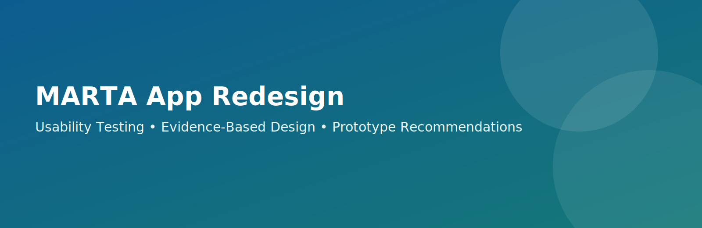

## Authors
- Siwan Yang
- Nitya
- Anusuka
- Natalie
- Anshika

## Summary
Our study evaluates and redesigns the MARTA mobile app to improve how riders plan trips, monitor live arrivals, purchase fares, and respond to service disruptions. The product we analyzed was the current MARTA app experience on core rider journeys that occur under real constraints: limited time, changing transit conditions, and variable familiarity with transit systems. We focused on product performance rather than user preference, tracking measurable outcomes such as task completion rate, time on task, and frequency of navigation errors.

Across usability testing, we observed recurring breakdowns in information hierarchy and interaction flow. Participants struggled to identify the next action on high-stakes screens, especially when switching between planning, ticketing, and service status views. Real-time data was present, but its placement and labeling reduced trust and increased decision delay. In ticketing, users often hesitated before confirmation because they were uncertain whether they had completed a purchase or only selected a fare option. These patterns indicated a system-wide clarity problem rather than isolated content issues.

Our prototype addresses these failures through structural and visual changes tied directly to evidence. We reorganized the app around four rider intents: Plan, Ride, Pay, and Alerts. We surfaced delay status and transfer guidance at key decision points, reduced screen-level clutter, and standardized primary action placement. We also added clearer confirmation states in payment flows and stronger affordances for filtering and route refinement. These changes were designed to reduce cognitive load, lower error rates, and increase confidence during time-sensitive decisions.

The key takeaway is that transit usability depends on fast comprehension under pressure. A successful redesign must prioritize clarity of system status, consistent action patterns, and accessibility-forward interaction targets before adding feature complexity. Our recommendations emphasize measurable improvements to efficiency and error prevention, creating a stronger hand-off for engineering implementation and future iterative testing.

## Introduction

Urban transit riders frequently make decisions in uncertain and time-constrained contexts. For MARTA users, this includes selecting routes while walking, checking delays while transferring, and purchasing fares while boarding. In these moments, interface clarity is not a convenience feature; it directly affects whether riders make correct and timely decisions. This project situates the MARTA app as a mission-critical tool where usability quality has immediate operational impact.

The existing MARTA mobile product provides valuable functions, including route search, real-time arrivals, ticket purchase, and service notifications. However, these functions are distributed across screens with inconsistent labeling and variable visual hierarchy. During initial product review, we identified friction in navigation depth, ambiguous status language, and inconsistent placement of high-priority actions. These issues suggested that users may need unnecessary effort to complete otherwise straightforward tasks.

Our target demographic includes daily commuters, occasional riders, and first-time or low-familiarity users in the Atlanta transit system. We also considered riders with accessibility needs, including users who rely on larger touch targets, high-contrast cues, and concise information grouping. Because transit usage spans different levels of expertise and urgency, the interface must support both routine behavior and rapid exception handling when disruptions occur.

We selected MARTA because it is a high-impact public service product where usability outcomes can be measured through speed, confidence, and completion success. Our early hypotheses were that users would struggle most with hidden filters, fragmented ticketing flows, and low-visibility service alerts. We also hypothesized that improving information architecture and action consistency would produce measurable gains in task efficiency and reduced user error.

