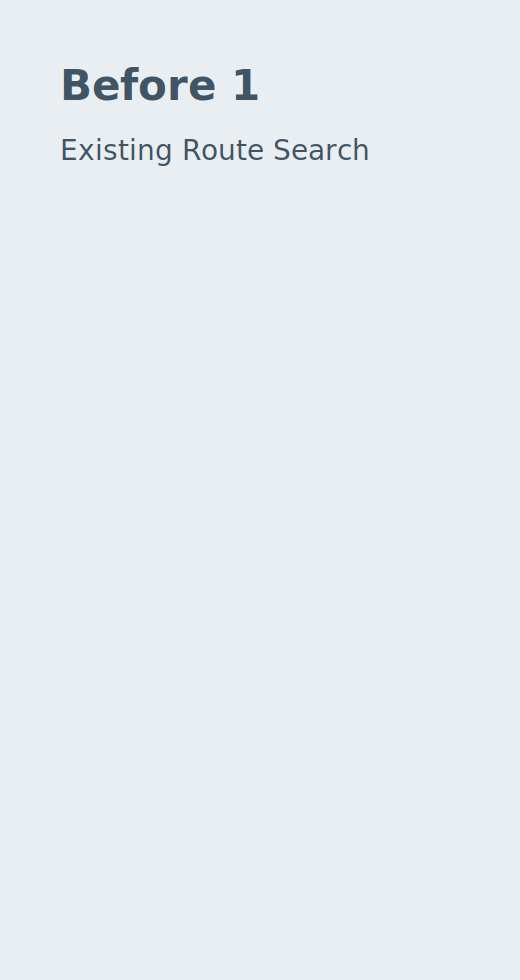
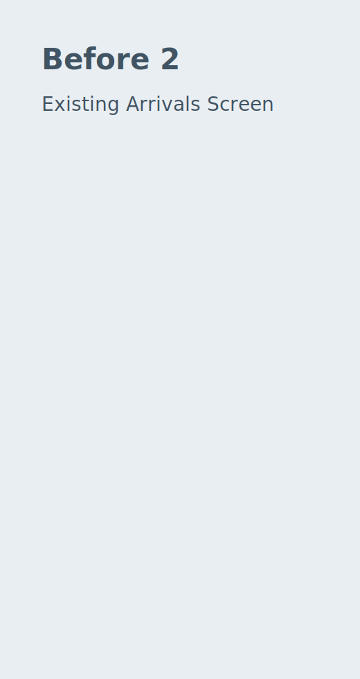
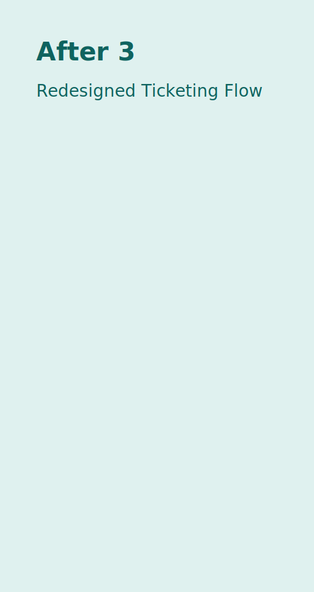
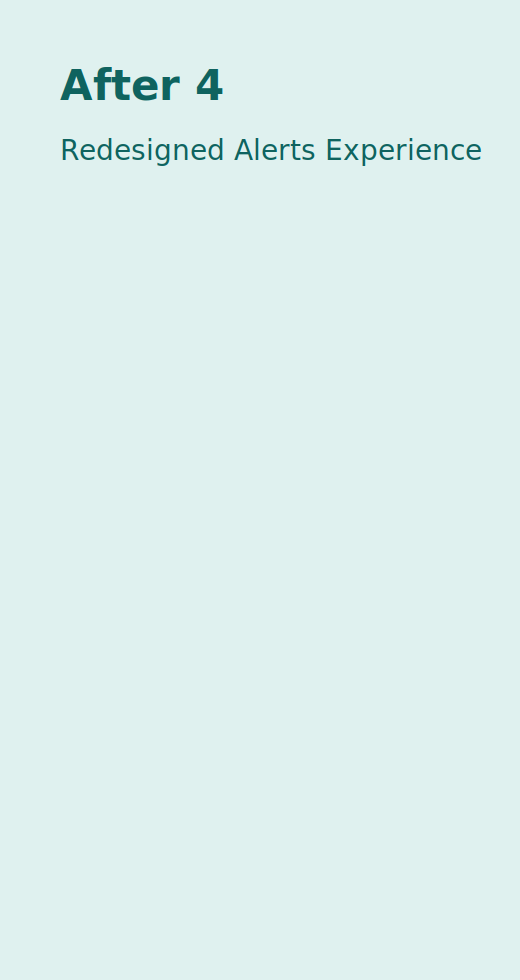

## Recommendations

Based on the usability evidence presented on the Data page, our redesign recommends five high-impact changes to improve rider efficiency, reduce user error, and strengthen accessibility. First, we consolidate navigation into clear intent-based destinations (`Plan`, `Ride`, `Pay`, `Alerts`) so users can begin tasks faster and with less backtracking. Compared with the existing product structure, this approach reduces ambiguity at task entry and improves wayfinding consistency.

Second, we elevate real-time status information into a higher visual hierarchy and pair each status element with clear timestamp context. In the current app, users reported uncertainty about whether delays were current. The redesigned approach uses explicit labels, stronger contrast, and consistent placement of live indicators. The benefit is increased trust and faster decision-making during transfers; the trade-off is slightly denser status modules, which must be carefully prioritized.

Third, we streamline ticket purchase into fewer decision points and add explicit completion feedback. Existing flows can feel repetitive and ambiguous at confirmation, causing duplicate attempts and hesitation. The redesigned sequence uses one primary action per step, clearer progressive disclosure, and a final confirmation state with immediate next actions. This directly targets error prevention and completion confidence.

Fourth, we improve disruption recovery by presenting alternate routes and recommended actions earlier in the flow. Instead of requiring riders to navigate across multiple screens after an alert, the prototype displays actionable re-route options in context. This improves efficiency and reduces cognitive load during time-sensitive scenarios.

Fifth, we improve accessibility by standardizing touch target sizes, improving contrast, and reducing visual clutter in dense screens. These refinements support a wider range of rider abilities and contexts without introducing separate workflows. The result is a more inclusive and robust interface that scales across user experience levels.

### Recommended Design Changes

1. Reorganize IA around rider intent (`Plan`, `Ride`, `Pay`, `Alerts`).
2. Surface real-time status and timestamps at primary decision points.
3. Simplify ticketing flow and strengthen payment confirmation states.
4. Add in-context disruption recovery actions with fewer navigation steps.
5. Apply accessibility-first interaction standards (tap size, contrast, hierarchy).

### Before and After Visual Comparisons

	<figure class="report-figure">
		
		<figcaption><strong>Before 1.</strong> Existing route planning flow with low action clarity.</figcaption>
	</figure>
	<figure class="report-figure">
		
		<figcaption><strong>After 1.</strong> Redesigned route planning with simplified task entry.</figcaption>
	</figure>

	<figure class="report-figure">
		
		<figcaption><strong>Before 2.</strong> Existing arrivals screen with weak live-status hierarchy.</figcaption>
	</figure>
	<figure class="report-figure">
		
		<figcaption><strong>After 2.</strong> Redesigned arrivals screen with clearer status trust signals.</figcaption>
	</figure>

	<figure class="report-figure">
		
		<figcaption><strong>Before 3.</strong> Existing ticketing flow with repeated confirmation uncertainty.</figcaption>
	</figure>
	<figure class="report-figure">
		
		<figcaption><strong>After 3.</strong> Redesigned ticketing with reduced errors and clearer completion state.</figcaption>
	</figure>

	<figure class="report-figure">
		
		<figcaption><strong>Before 4.</strong> Existing disruption flow requiring excessive navigation.</figcaption>
	</figure>
	<figure class="report-figure">
		
		<figcaption><strong>After 4.</strong> Redesigned disruption handling with faster reroute decisions.</figcaption>
	</figure>

### High-Fidelity Prototype

At the following link you will find our fully interactive high fidelity prototype.

[Figma Prototype Link](https://www.figma.com/design/pyTklg4RE8q790WSq0ZYlr/Marta-HiFi-Prototype?node-id=0-1&p=f&t=ux6h0CJXDWcso0US-0)

## Conclusion

This project demonstrates that transit interface redesign should be grounded in measurable usability evidence, not visual preference alone. Through task-based testing, we identified where riders lose time, confidence, and accuracy, then translated those patterns into focused design changes that improve comprehension and action speed.

Our team learned that small interface decisions—label clarity, status placement, action hierarchy, and confirmation feedback—have large behavioral effects when users are under time pressure. The strongest outcomes came from aligning each design choice to a specific observed failure mode in the existing product.

For engineering hand-off, we recommend implementing the redesign in priority order based on measured impact: route decision clarity, real-time status trust, and ticketing confirmation first, followed by iterative accessibility refinements. Instrument these flows with analytics for completion rate, time on task, and error events so post-launch validation can confirm that the redesign delivers the expected usability gains.
